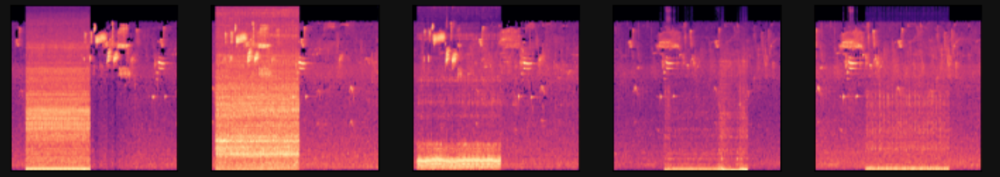
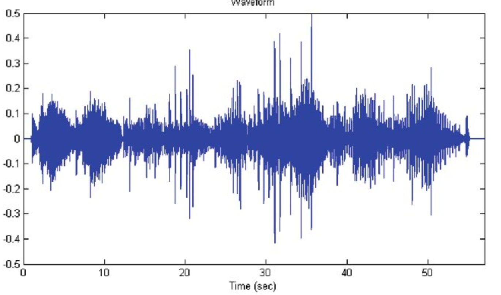

# Audio Classification with CNN

This project utilizes Convolutional Neural Networks (CNNs) to classify real-time audio in rainforest environments, detecting sounds such as chainsaws, engines, and storms.

- Data: Audio signals are converted into spectrograms using Librosa, with training data generated from UrbanSound8K and rainforest recordings.

- Model: A Keras CNN is trained to recognize key sound categories and can be converted to TensorFlow Lite for mobile deployment.

- Libraries & Frameworks: TensorFlow/Keras for modeling, Librosa for audio processing, Scaper for synthetic data generation.

- Deployment: Lightweight and optimized for on-device inference on mobile devices for real-time environmental monitoring.

---
<p align="center">
  
</p>
<p align="center">
  
</p>

---

## 🧠 Project Overview

Illegal logging is a major contributor to deforestation and global carbon emissions.  
This project aims to **detect logging activity** using audio captured from **recycled, solar-powered smartphones** placed throughout rainforests.

Audio signals are transformed into **spectrograms** and classified by a **Keras CNN** trained to distinguish between:
- 🌳 Rainforest background sounds  
- 🪚 Chainsaws  
- 🚛 Truck engines  
- ⛈️ Thunderstorms  

---

## ⚙️ Pipeline

1. **Data Generation:**  
   - Synthetic soundscapes created with [Scaper](https://pypi.org/project/scaper/)  
   - Base sounds from [UrbanSound8K](https://urbansounddataset.weebly.com/urbansound8k.html) + rainforest sounds (YouTube)

2. **Preprocessing:**  
   - Convert `.wav` files to spectrograms using [Librosa](https://librosa.org/)

3. **Model:**  
   - CNN implemented with **TensorFlow/Keras**
   - Designed for **on-device inference** (TensorFlow Lite conversion possible)

4. **Evaluation:**  
   - Accuracy and loss metrics on training/validation sets  
   - Visualization of spectrogram samples and predictions

---

## 📱 Mobile Integration

The trained model can be:
- Converted to **TensorFlow Lite** for Android deployment  
- Embedded in a **mobile app** that listens for real-time audio and triggers alerts on detecting illegal activity

---
## 📂 Repository Structure
```
Audio-Classification-with-CNN/
│
├── Audio Classification with CNN.ipynb # Main notebook
├── data/ # Audio files & spectrograms
├── models/ # Saved Keras or TFLite models
├── README.md # Project overview
└── requirements.txt # Python dependencies
```

## 🧩 Requirements

### Install all dependencies:

```bash
pip install -r requirements.txt
```

## 🌍 Inspiration

Inspired by [Rainforest Connection (RFCx)](https://rfcx.org/) — an organization using AI and recycled Android phones to protect rainforests from illegal logging.  
Learn more on the [Google AI Blog](https://blog.google/technology/ai/fight-against-illegal-deforestation-tensorflow/).
